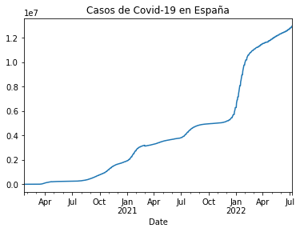
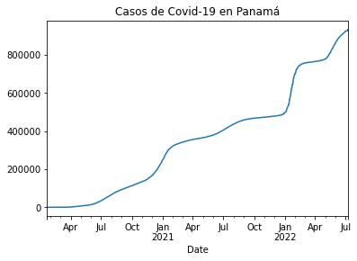
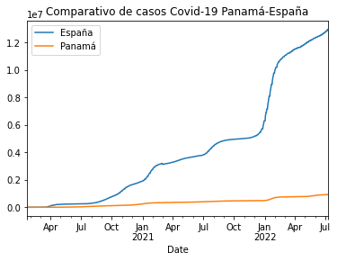
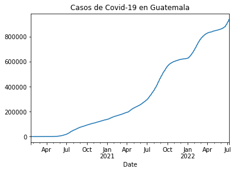
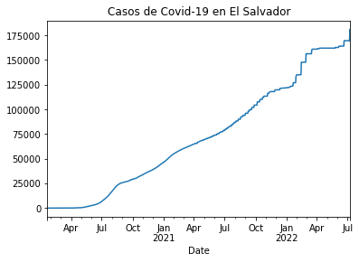
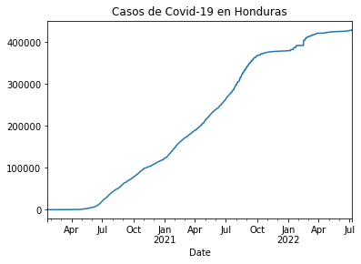
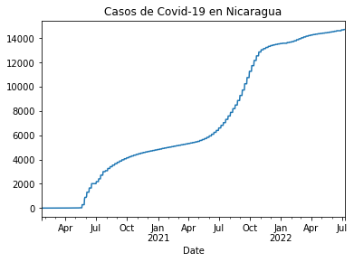
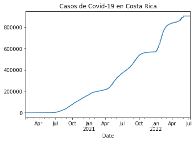
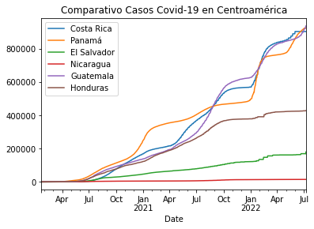

# Actividad Dirigida 4

La última actividad dirigida del módulo de __Periodismo de Datos II__ consistía en la creación de un cuaderno de Jupyter en la aplicación del mismo nombre. Desde ahí tendríamos que ejecutar códigos con Python y pandas para la presentación y visualización de datos del Covid-19 en España, Panamá y Centroamérica.

En primer lugar, desde el _Jupyter Notebook_ se creó un archivo al que se denominó `ad4.ipynb` donde nos conectamos a la API [https://covid19api.com/](https://covid19api.com/)

Instalamos la libreria de "pandas" con `pip` [comando](https://pip.pypa.io/en/stable/), que funciona para la gestión de paquetes utilizado para instalar y administrar paquetes de software escritos en Python.


```python
!pip install pandas
```

    Requirement already satisfied: pandas in c:\users\sergio rivera\anaconda3\lib\site-packages (1.4.2)
    Requirement already satisfied: numpy>=1.18.5 in c:\users\sergio rivera\anaconda3\lib\site-packages (from pandas) (1.21.5)
    Requirement already satisfied: python-dateutil>=2.8.1 in c:\users\sergio rivera\anaconda3\lib\site-packages (from pandas) (2.8.2)
    Requirement already satisfied: pytz>=2020.1 in c:\users\sergio rivera\anaconda3\lib\site-packages (from pandas) (2021.3)
    Requirement already satisfied: six>=1.5 in c:\users\sergio rivera\anaconda3\lib\site-packages (from python-dateutil>=2.8.1->pandas) (1.16.0)
    

Una vez instaladas las librerias de pandas, usamos `import` para tener acceso al codigo de pandas e importarlo como `pd`.


```python
import pandas as pd
```

Se utilizó `url` para vincular la dirección del sitio web desde donde se obtendrían los datos para la presentación de visualizaciones. Comprobamos que con introducir `url` la variable está relacionada automáticamente con esta dirección de la API.


```python
url = 'https://api.covid19api.com/countries'
```


```python
url
```


    'https://api.covid19api.com/countries'


Con `df` se genera una orden para que `pd` (pandas) lea la informacion contenida en la url con lenguaje `Json`. Inmediatamente vemos que al activarlo, se genera una tabla general con todos los datos existentes. Esta parte sirvió como ejemplo para el desarrollo de las otras tareas.


```python
df = pd.read_json(url)
```


```python
df
```


<div>
<style scoped>
    .dataframe tbody tr th:only-of-type {
        vertical-align: middle;
    }

    .dataframe tbody tr th {
        vertical-align: top;
    }

    .dataframe thead th {
        text-align: right;
    }
</style>
<table border="1" class="dataframe">
  <thead>
    <tr style="text-align: right;">
      <th></th>
      <th>Country</th>
      <th>Slug</th>
      <th>ISO2</th>
    </tr>
  </thead>
  <tbody>
    <tr>
      <th>0</th>
      <td>Gibraltar</td>
      <td>gibraltar</td>
      <td>GI</td>
    </tr>
    <tr>
      <th>1</th>
      <td>Oman</td>
      <td>oman</td>
      <td>OM</td>
    </tr>
    <tr>
      <th>2</th>
      <td>France</td>
      <td>france</td>
      <td>FR</td>
    </tr>
    <tr>
      <th>3</th>
      <td>Jersey</td>
      <td>jersey</td>
      <td>JE</td>
    </tr>
    <tr>
      <th>4</th>
      <td>Mali</td>
      <td>mali</td>
      <td>ML</td>
    </tr>
    <tr>
      <th>...</th>
      <td>...</td>
      <td>...</td>
      <td>...</td>
    </tr>
    <tr>
      <th>243</th>
      <td>Puerto Rico</td>
      <td>puerto-rico</td>
      <td>PR</td>
    </tr>
    <tr>
      <th>244</th>
      <td>Papua New Guinea</td>
      <td>papua-new-guinea</td>
      <td>PG</td>
    </tr>
    <tr>
      <th>245</th>
      <td>Saint Pierre and Miquelon</td>
      <td>saint-pierre-and-miquelon</td>
      <td>PM</td>
    </tr>
    <tr>
      <th>246</th>
      <td>Timor-Leste</td>
      <td>timor-leste</td>
      <td>TL</td>
    </tr>
    <tr>
      <th>247</th>
      <td>Montenegro</td>
      <td>montenegro</td>
      <td>ME</td>
    </tr>
  </tbody>
</table>
<p>248 rows × 3 columns</p>
</div>


## Casos Covid-19 en España

Con la variable para `dataframe` y `==` le pedimos al sistema que nos genere la posición en la lista para España, con su respectiva nomenclatura, la cual nos ayudaría para la designación de nombres a las variables y funciones a usar en pasos posteriores.


```python
df[df['Country'] == 'Spain']
```


<div>
<style scoped>
    .dataframe tbody tr th:only-of-type {
        vertical-align: middle;
    }

    .dataframe tbody tr th {
        vertical-align: top;
    }

    .dataframe thead th {
        text-align: right;
    }
</style>
<table border="1" class="dataframe">
  <thead>
    <tr style="text-align: right;">
      <th></th>
      <th>Country</th>
      <th>Slug</th>
      <th>ISO2</th>
    </tr>
  </thead>
  <tbody>
    <tr>
      <th>141</th>
      <td>Spain</td>
      <td>spain</td>
      <td>ES</td>
    </tr>
  </tbody>
</table>
</div>


Para el ejercicio se comenzó utilizando la variable `url_rt_es` para denominar al sitio web de donde se obtendrian los datos del Covid-19 para España. Con el uso de `pd.read_json` + la `url_rt_es` entre parentesis `()` se imprime una tabla con los datos existentes en la API para Espa;a.


```python
url_rt_es = 'https://api.covid19api.com/country/spain/status/confirmed/live'
df_rt_es = pd.read_json(url_rt_es)
df_rt_es
```


<div>
<style scoped>
    .dataframe tbody tr th:only-of-type {
        vertical-align: middle;
    }

    .dataframe tbody tr th {
        vertical-align: top;
    }

    .dataframe thead th {
        text-align: right;
    }
</style>
<table border="1" class="dataframe">
  <thead>
    <tr style="text-align: right;">
      <th></th>
      <th>Country</th>
      <th>CountryCode</th>
      <th>Province</th>
      <th>City</th>
      <th>CityCode</th>
      <th>Lat</th>
      <th>Lon</th>
      <th>Cases</th>
      <th>Status</th>
      <th>Date</th>
    </tr>
  </thead>
  <tbody>
    <tr>
      <th>0</th>
      <td>Spain</td>
      <td>ES</td>
      <td></td>
      <td></td>
      <td></td>
      <td>40.46</td>
      <td>-3.75</td>
      <td>0</td>
      <td>confirmed</td>
      <td>2020-01-22 00:00:00+00:00</td>
    </tr>
    <tr>
      <th>1</th>
      <td>Spain</td>
      <td>ES</td>
      <td></td>
      <td></td>
      <td></td>
      <td>40.46</td>
      <td>-3.75</td>
      <td>0</td>
      <td>confirmed</td>
      <td>2020-01-23 00:00:00+00:00</td>
    </tr>
    <tr>
      <th>2</th>
      <td>Spain</td>
      <td>ES</td>
      <td></td>
      <td></td>
      <td></td>
      <td>40.46</td>
      <td>-3.75</td>
      <td>0</td>
      <td>confirmed</td>
      <td>2020-01-24 00:00:00+00:00</td>
    </tr>
    <tr>
      <th>3</th>
      <td>Spain</td>
      <td>ES</td>
      <td></td>
      <td></td>
      <td></td>
      <td>40.46</td>
      <td>-3.75</td>
      <td>0</td>
      <td>confirmed</td>
      <td>2020-01-25 00:00:00+00:00</td>
    </tr>
    <tr>
      <th>4</th>
      <td>Spain</td>
      <td>ES</td>
      <td></td>
      <td></td>
      <td></td>
      <td>40.46</td>
      <td>-3.75</td>
      <td>0</td>
      <td>confirmed</td>
      <td>2020-01-26 00:00:00+00:00</td>
    </tr>
    <tr>
      <th>...</th>
      <td>...</td>
      <td>...</td>
      <td>...</td>
      <td>...</td>
      <td>...</td>
      <td>...</td>
      <td>...</td>
      <td>...</td>
      <td>...</td>
      <td>...</td>
    </tr>
    <tr>
      <th>894</th>
      <td>Spain</td>
      <td>ES</td>
      <td></td>
      <td></td>
      <td></td>
      <td>40.46</td>
      <td>-3.75</td>
      <td>12818184</td>
      <td>confirmed</td>
      <td>2022-07-04 00:00:00+00:00</td>
    </tr>
    <tr>
      <th>895</th>
      <td>Spain</td>
      <td>ES</td>
      <td></td>
      <td></td>
      <td></td>
      <td>40.46</td>
      <td>-3.75</td>
      <td>12890002</td>
      <td>confirmed</td>
      <td>2022-07-05 00:00:00+00:00</td>
    </tr>
    <tr>
      <th>896</th>
      <td>Spain</td>
      <td>ES</td>
      <td></td>
      <td></td>
      <td></td>
      <td>40.46</td>
      <td>-3.75</td>
      <td>12890002</td>
      <td>confirmed</td>
      <td>2022-07-06 00:00:00+00:00</td>
    </tr>
    <tr>
      <th>897</th>
      <td>Spain</td>
      <td>ES</td>
      <td></td>
      <td></td>
      <td></td>
      <td>40.46</td>
      <td>-3.75</td>
      <td>12890002</td>
      <td>confirmed</td>
      <td>2022-07-07 00:00:00+00:00</td>
    </tr>
    <tr>
      <th>898</th>
      <td>Spain</td>
      <td>ES</td>
      <td></td>
      <td></td>
      <td></td>
      <td>40.46</td>
      <td>-3.75</td>
      <td>12973615</td>
      <td>confirmed</td>
      <td>2022-07-08 00:00:00+00:00</td>
    </tr>
  </tbody>
</table>
<p>899 rows × 10 columns</p>
</div>


Con el uso de `.head()` se logra imprimer la cabecera de la lista.


```python
df_rt_es.head()
```


<div>
<style scoped>
    .dataframe tbody tr th:only-of-type {
        vertical-align: middle;
    }

    .dataframe tbody tr th {
        vertical-align: top;
    }

    .dataframe thead th {
        text-align: right;
    }
</style>
<table border="1" class="dataframe">
  <thead>
    <tr style="text-align: right;">
      <th></th>
      <th>Country</th>
      <th>CountryCode</th>
      <th>Province</th>
      <th>City</th>
      <th>CityCode</th>
      <th>Lat</th>
      <th>Lon</th>
      <th>Cases</th>
      <th>Status</th>
      <th>Date</th>
    </tr>
  </thead>
  <tbody>
    <tr>
      <th>0</th>
      <td>Spain</td>
      <td>ES</td>
      <td></td>
      <td></td>
      <td></td>
      <td>40.46</td>
      <td>-3.75</td>
      <td>0</td>
      <td>confirmed</td>
      <td>2020-01-22 00:00:00+00:00</td>
    </tr>
    <tr>
      <th>1</th>
      <td>Spain</td>
      <td>ES</td>
      <td></td>
      <td></td>
      <td></td>
      <td>40.46</td>
      <td>-3.75</td>
      <td>0</td>
      <td>confirmed</td>
      <td>2020-01-23 00:00:00+00:00</td>
    </tr>
    <tr>
      <th>2</th>
      <td>Spain</td>
      <td>ES</td>
      <td></td>
      <td></td>
      <td></td>
      <td>40.46</td>
      <td>-3.75</td>
      <td>0</td>
      <td>confirmed</td>
      <td>2020-01-24 00:00:00+00:00</td>
    </tr>
    <tr>
      <th>3</th>
      <td>Spain</td>
      <td>ES</td>
      <td></td>
      <td></td>
      <td></td>
      <td>40.46</td>
      <td>-3.75</td>
      <td>0</td>
      <td>confirmed</td>
      <td>2020-01-25 00:00:00+00:00</td>
    </tr>
    <tr>
      <th>4</th>
      <td>Spain</td>
      <td>ES</td>
      <td></td>
      <td></td>
      <td></td>
      <td>40.46</td>
      <td>-3.75</td>
      <td>0</td>
      <td>confirmed</td>
      <td>2020-01-26 00:00:00+00:00</td>
    </tr>
  </tbody>
</table>
</div>


Con la implementación de `.tail()` se pueden imprimir los datos alojados al final de la tabla.


```python
df_rt_es.tail()
```


<div>
<style scoped>
    .dataframe tbody tr th:only-of-type {
        vertical-align: middle;
    }

    .dataframe tbody tr th {
        vertical-align: top;
    }

    .dataframe thead th {
        text-align: right;
    }
</style>
<table border="1" class="dataframe">
  <thead>
    <tr style="text-align: right;">
      <th></th>
      <th>Country</th>
      <th>CountryCode</th>
      <th>Province</th>
      <th>City</th>
      <th>CityCode</th>
      <th>Lat</th>
      <th>Lon</th>
      <th>Cases</th>
      <th>Status</th>
      <th>Date</th>
    </tr>
  </thead>
  <tbody>
    <tr>
      <th>894</th>
      <td>Spain</td>
      <td>ES</td>
      <td></td>
      <td></td>
      <td></td>
      <td>40.46</td>
      <td>-3.75</td>
      <td>12818184</td>
      <td>confirmed</td>
      <td>2022-07-04 00:00:00+00:00</td>
    </tr>
    <tr>
      <th>895</th>
      <td>Spain</td>
      <td>ES</td>
      <td></td>
      <td></td>
      <td></td>
      <td>40.46</td>
      <td>-3.75</td>
      <td>12890002</td>
      <td>confirmed</td>
      <td>2022-07-05 00:00:00+00:00</td>
    </tr>
    <tr>
      <th>896</th>
      <td>Spain</td>
      <td>ES</td>
      <td></td>
      <td></td>
      <td></td>
      <td>40.46</td>
      <td>-3.75</td>
      <td>12890002</td>
      <td>confirmed</td>
      <td>2022-07-06 00:00:00+00:00</td>
    </tr>
    <tr>
      <th>897</th>
      <td>Spain</td>
      <td>ES</td>
      <td></td>
      <td></td>
      <td></td>
      <td>40.46</td>
      <td>-3.75</td>
      <td>12890002</td>
      <td>confirmed</td>
      <td>2022-07-07 00:00:00+00:00</td>
    </tr>
    <tr>
      <th>898</th>
      <td>Spain</td>
      <td>ES</td>
      <td></td>
      <td></td>
      <td></td>
      <td>40.46</td>
      <td>-3.75</td>
      <td>12973615</td>
      <td>confirmed</td>
      <td>2022-07-08 00:00:00+00:00</td>
    </tr>
  </tbody>
</table>
</div>


Se le coloca nuevo nombre a las funciones para facilitar su ejecucion. Mas adelante tambien se expone que un `index` aloja los datos de fechas "Date" mientras que en el otro eje `Y` se muestra el numero de contagios. Con el uso de `.plot()` y `title` se le puede poner titulo a la visualizacion.


```python
casos_es = df_rt_es.set_index('Date')['Cases']
casos_es.plot(title="Casos de Covid-19 en España")
```


    <AxesSubplot:title={'center':'Casos de Covid-19 en España'}, xlabel='Date'>


    

    


## Casos Covid-19 en Panamá

El mismo procedimiento realizado con los datos de España se vuelven a cumplir para el caso de Panamá. Se identifica la nomenclatura de país para Panamá y se imprime la posición dentro de este listado.


```python
df[df['Country'] == 'Panama']
```


<div>
<style scoped>
    .dataframe tbody tr th:only-of-type {
        vertical-align: middle;
    }

    .dataframe tbody tr th {
        vertical-align: top;
    }

    .dataframe thead th {
        text-align: right;
    }
</style>
<table border="1" class="dataframe">
  <thead>
    <tr style="text-align: right;">
      <th></th>
      <th>Country</th>
      <th>Slug</th>
      <th>ISO2</th>
    </tr>
  </thead>
  <tbody>
    <tr>
      <th>190</th>
      <td>Panama</td>
      <td>panama</td>
      <td>PA</td>
    </tr>
  </tbody>
</table>
</div>


Con la nueva `url` se leeran e imprimiran los datos de covid-19 para el pais.


```python
url_rt_pa = 'https://api.covid19api.com/country/panama/status/confirmed/live'
df_rt_pa = pd.read_json(url_rt_pa)
df_rt_pa
```


<div>
<style scoped>
    .dataframe tbody tr th:only-of-type {
        vertical-align: middle;
    }

    .dataframe tbody tr th {
        vertical-align: top;
    }

    .dataframe thead th {
        text-align: right;
    }
</style>
<table border="1" class="dataframe">
  <thead>
    <tr style="text-align: right;">
      <th></th>
      <th>Country</th>
      <th>CountryCode</th>
      <th>Province</th>
      <th>City</th>
      <th>CityCode</th>
      <th>Lat</th>
      <th>Lon</th>
      <th>Cases</th>
      <th>Status</th>
      <th>Date</th>
    </tr>
  </thead>
  <tbody>
    <tr>
      <th>0</th>
      <td>Panama</td>
      <td>PA</td>
      <td></td>
      <td></td>
      <td></td>
      <td>8.54</td>
      <td>-80.78</td>
      <td>0</td>
      <td>confirmed</td>
      <td>2020-01-22 00:00:00+00:00</td>
    </tr>
    <tr>
      <th>1</th>
      <td>Panama</td>
      <td>PA</td>
      <td></td>
      <td></td>
      <td></td>
      <td>8.54</td>
      <td>-80.78</td>
      <td>0</td>
      <td>confirmed</td>
      <td>2020-01-23 00:00:00+00:00</td>
    </tr>
    <tr>
      <th>2</th>
      <td>Panama</td>
      <td>PA</td>
      <td></td>
      <td></td>
      <td></td>
      <td>8.54</td>
      <td>-80.78</td>
      <td>0</td>
      <td>confirmed</td>
      <td>2020-01-24 00:00:00+00:00</td>
    </tr>
    <tr>
      <th>3</th>
      <td>Panama</td>
      <td>PA</td>
      <td></td>
      <td></td>
      <td></td>
      <td>8.54</td>
      <td>-80.78</td>
      <td>0</td>
      <td>confirmed</td>
      <td>2020-01-25 00:00:00+00:00</td>
    </tr>
    <tr>
      <th>4</th>
      <td>Panama</td>
      <td>PA</td>
      <td></td>
      <td></td>
      <td></td>
      <td>8.54</td>
      <td>-80.78</td>
      <td>0</td>
      <td>confirmed</td>
      <td>2020-01-26 00:00:00+00:00</td>
    </tr>
    <tr>
      <th>...</th>
      <td>...</td>
      <td>...</td>
      <td>...</td>
      <td>...</td>
      <td>...</td>
      <td>...</td>
      <td>...</td>
      <td>...</td>
      <td>...</td>
      <td>...</td>
    </tr>
    <tr>
      <th>895</th>
      <td>Panama</td>
      <td>PA</td>
      <td></td>
      <td></td>
      <td></td>
      <td>8.54</td>
      <td>-80.78</td>
      <td>925254</td>
      <td>confirmed</td>
      <td>2022-07-05 00:00:00+00:00</td>
    </tr>
    <tr>
      <th>896</th>
      <td>Panama</td>
      <td>PA</td>
      <td></td>
      <td></td>
      <td></td>
      <td>8.54</td>
      <td>-80.78</td>
      <td>925254</td>
      <td>confirmed</td>
      <td>2022-07-06 00:00:00+00:00</td>
    </tr>
    <tr>
      <th>897</th>
      <td>Panama</td>
      <td>PA</td>
      <td></td>
      <td></td>
      <td></td>
      <td>8.54</td>
      <td>-80.78</td>
      <td>925254</td>
      <td>confirmed</td>
      <td>2022-07-07 00:00:00+00:00</td>
    </tr>
    <tr>
      <th>898</th>
      <td>Panama</td>
      <td>PA</td>
      <td></td>
      <td></td>
      <td></td>
      <td>8.54</td>
      <td>-80.78</td>
      <td>932710</td>
      <td>confirmed</td>
      <td>2022-07-08 00:00:00+00:00</td>
    </tr>
    <tr>
      <th>899</th>
      <td>Panama</td>
      <td>PA</td>
      <td></td>
      <td></td>
      <td></td>
      <td>8.54</td>
      <td>-80.78</td>
      <td>925254</td>
      <td>confirmed</td>
      <td>2022-07-09 00:00:00+00:00</td>
    </tr>
  </tbody>
</table>
<p>900 rows × 10 columns</p>
</div>


Una vez realizado un vistazo a las cifras de Covid-19 en Panama, usamos las funciones `.set_index` y `.plop()` para imprimer los resultados.


```python
casos_pa = df_rt_pa.set_index('Date')['Cases']
casos_pa.plot(title="Casos de Covid-19 en Panamá")
```


    <AxesSubplot:title={'center':'Casos de Covid-19 en Panamá'}, xlabel='Date'>


    

    


## Ploteamos dos países

De forma previa ya teníamos los datos de Covid-19 en Panamá y España. Como parte de las tareas en clases, se denominaron variables para Panamá `casos_pa` y España `casos_es`. Comprobamos que se listaran las cifras para cada país.


```python
casos_pa
```


    Date
    2020-01-22 00:00:00+00:00         0
    2020-01-23 00:00:00+00:00         0
    2020-01-24 00:00:00+00:00         0
    2020-01-25 00:00:00+00:00         0
    2020-01-26 00:00:00+00:00         0
                                  ...  
    2022-07-05 00:00:00+00:00    925254
    2022-07-06 00:00:00+00:00    925254
    2022-07-07 00:00:00+00:00    925254
    2022-07-08 00:00:00+00:00    932710
    2022-07-09 00:00:00+00:00    925254
    Name: Cases, Length: 900, dtype: int64


```python
casos_es
```


    Date
    2020-01-22 00:00:00+00:00           0
    2020-01-23 00:00:00+00:00           0
    2020-01-24 00:00:00+00:00           0
    2020-01-25 00:00:00+00:00           0
    2020-01-26 00:00:00+00:00           0
                                   ...   
    2022-07-04 00:00:00+00:00    12818184
    2022-07-05 00:00:00+00:00    12890002
    2022-07-06 00:00:00+00:00    12890002
    2022-07-07 00:00:00+00:00    12890002
    2022-07-08 00:00:00+00:00    12973615
    Name: Cases, Length: 899, dtype: int64


Para observar los datos que serían comparados en primera instancia se usó `pd.concat` con el uso de variables para ambos paises y `axis` para la muestra de datos en columnas. Previamente se le puso un nombre para facilitar la busqueda de los datos a comparar.


```python
pa_vs_es = pd.concat([casos_es, casos_pa],axis=1)
pa_vs_es
```


<div>
<style scoped>
    .dataframe tbody tr th:only-of-type {
        vertical-align: middle;
    }

    .dataframe tbody tr th {
        vertical-align: top;
    }

    .dataframe thead th {
        text-align: right;
    }
</style>
<table border="1" class="dataframe">
  <thead>
    <tr style="text-align: right;">
      <th></th>
      <th>Cases</th>
      <th>Cases</th>
    </tr>
    <tr>
      <th>Date</th>
      <th></th>
      <th></th>
    </tr>
  </thead>
  <tbody>
    <tr>
      <th>2020-01-22 00:00:00+00:00</th>
      <td>0.0</td>
      <td>0</td>
    </tr>
    <tr>
      <th>2020-01-23 00:00:00+00:00</th>
      <td>0.0</td>
      <td>0</td>
    </tr>
    <tr>
      <th>2020-01-24 00:00:00+00:00</th>
      <td>0.0</td>
      <td>0</td>
    </tr>
    <tr>
      <th>2020-01-25 00:00:00+00:00</th>
      <td>0.0</td>
      <td>0</td>
    </tr>
    <tr>
      <th>2020-01-26 00:00:00+00:00</th>
      <td>0.0</td>
      <td>0</td>
    </tr>
    <tr>
      <th>...</th>
      <td>...</td>
      <td>...</td>
    </tr>
    <tr>
      <th>2022-07-05 00:00:00+00:00</th>
      <td>12890002.0</td>
      <td>925254</td>
    </tr>
    <tr>
      <th>2022-07-06 00:00:00+00:00</th>
      <td>12890002.0</td>
      <td>925254</td>
    </tr>
    <tr>
      <th>2022-07-07 00:00:00+00:00</th>
      <td>12890002.0</td>
      <td>925254</td>
    </tr>
    <tr>
      <th>2022-07-08 00:00:00+00:00</th>
      <td>12973615.0</td>
      <td>932710</td>
    </tr>
    <tr>
      <th>2022-07-09 00:00:00+00:00</th>
      <td>NaN</td>
      <td>925254</td>
    </tr>
  </tbody>
</table>
<p>900 rows × 2 columns</p>
</div>


Al colocar `.columns` se le pone nombre a los datos presentados en la tabla que utilizaremos para realizar el comparativo de casos. Observamos los resultados del uso de estos comandos, en la siguiente presentación.


```python
pa_vs_es.columns = ['España','Panamá']
pa_vs_es
```


<div>
<style scoped>
    .dataframe tbody tr th:only-of-type {
        vertical-align: middle;
    }

    .dataframe tbody tr th {
        vertical-align: top;
    }

    .dataframe thead th {
        text-align: right;
    }
</style>
<table border="1" class="dataframe">
  <thead>
    <tr style="text-align: right;">
      <th></th>
      <th>España</th>
      <th>Panamá</th>
    </tr>
    <tr>
      <th>Date</th>
      <th></th>
      <th></th>
    </tr>
  </thead>
  <tbody>
    <tr>
      <th>2020-01-22 00:00:00+00:00</th>
      <td>0.0</td>
      <td>0</td>
    </tr>
    <tr>
      <th>2020-01-23 00:00:00+00:00</th>
      <td>0.0</td>
      <td>0</td>
    </tr>
    <tr>
      <th>2020-01-24 00:00:00+00:00</th>
      <td>0.0</td>
      <td>0</td>
    </tr>
    <tr>
      <th>2020-01-25 00:00:00+00:00</th>
      <td>0.0</td>
      <td>0</td>
    </tr>
    <tr>
      <th>2020-01-26 00:00:00+00:00</th>
      <td>0.0</td>
      <td>0</td>
    </tr>
    <tr>
      <th>...</th>
      <td>...</td>
      <td>...</td>
    </tr>
    <tr>
      <th>2022-07-05 00:00:00+00:00</th>
      <td>12890002.0</td>
      <td>925254</td>
    </tr>
    <tr>
      <th>2022-07-06 00:00:00+00:00</th>
      <td>12890002.0</td>
      <td>925254</td>
    </tr>
    <tr>
      <th>2022-07-07 00:00:00+00:00</th>
      <td>12890002.0</td>
      <td>925254</td>
    </tr>
    <tr>
      <th>2022-07-08 00:00:00+00:00</th>
      <td>12973615.0</td>
      <td>932710</td>
    </tr>
    <tr>
      <th>2022-07-09 00:00:00+00:00</th>
      <td>NaN</td>
      <td>925254</td>
    </tr>
  </tbody>
</table>
<p>900 rows × 2 columns</p>
</div>


Con el nombre asignado a nuestros datos, sumado a `.plot` podemos imprimir la gráfica de visualización, donde se nos permite ver el comportamiento de los casos de Covid-19 en España, en comparación con Panamá. En esta parte se le puede colocar un título a la visualización.


```python
pa_vs_es.plot(title="Comparativo de casos Covid-19 Panamá-España")
```


    <AxesSubplot:title={'center':'Comparativo de casos Covid-19 Panamá-España'}, xlabel='Date'>


    

    


## Comparativo de países de Centroamérica

Se nos pidió realizar un comparativo de las cifras de Covid-19 entre los países de Centroamérica, a saber: 
1. Guatemala
2. El Salvador
3. Honduras
4. Nicaragua
5. Costa Rica
6. Panamá

Comenzamos por echar un vistazo a las cifras de Covid-19 para cada país, resaltando que ya conocemos los de Panamá. Para cada uno de los paises de Centroamerica tambien podremos ver una visualizacion, con el uso de un `index` y un `.plot()`.


```python
url_rt_pa = 'https://api.covid19api.com/country/panama/status/confirmed/live'
df_rt_pa = pd.read_json(url_rt_pa)
df_rt_pa
```


<div>
<style scoped>
    .dataframe tbody tr th:only-of-type {
        vertical-align: middle;
    }

    .dataframe tbody tr th {
        vertical-align: top;
    }

    .dataframe thead th {
        text-align: right;
    }
</style>
<table border="1" class="dataframe">
  <thead>
    <tr style="text-align: right;">
      <th></th>
      <th>Country</th>
      <th>CountryCode</th>
      <th>Province</th>
      <th>City</th>
      <th>CityCode</th>
      <th>Lat</th>
      <th>Lon</th>
      <th>Cases</th>
      <th>Status</th>
      <th>Date</th>
    </tr>
  </thead>
  <tbody>
    <tr>
      <th>0</th>
      <td>Panama</td>
      <td>PA</td>
      <td></td>
      <td></td>
      <td></td>
      <td>8.54</td>
      <td>-80.78</td>
      <td>0</td>
      <td>confirmed</td>
      <td>2020-01-22 00:00:00+00:00</td>
    </tr>
    <tr>
      <th>1</th>
      <td>Panama</td>
      <td>PA</td>
      <td></td>
      <td></td>
      <td></td>
      <td>8.54</td>
      <td>-80.78</td>
      <td>0</td>
      <td>confirmed</td>
      <td>2020-01-23 00:00:00+00:00</td>
    </tr>
    <tr>
      <th>2</th>
      <td>Panama</td>
      <td>PA</td>
      <td></td>
      <td></td>
      <td></td>
      <td>8.54</td>
      <td>-80.78</td>
      <td>0</td>
      <td>confirmed</td>
      <td>2020-01-24 00:00:00+00:00</td>
    </tr>
    <tr>
      <th>3</th>
      <td>Panama</td>
      <td>PA</td>
      <td></td>
      <td></td>
      <td></td>
      <td>8.54</td>
      <td>-80.78</td>
      <td>0</td>
      <td>confirmed</td>
      <td>2020-01-25 00:00:00+00:00</td>
    </tr>
    <tr>
      <th>4</th>
      <td>Panama</td>
      <td>PA</td>
      <td></td>
      <td></td>
      <td></td>
      <td>8.54</td>
      <td>-80.78</td>
      <td>0</td>
      <td>confirmed</td>
      <td>2020-01-26 00:00:00+00:00</td>
    </tr>
    <tr>
      <th>...</th>
      <td>...</td>
      <td>...</td>
      <td>...</td>
      <td>...</td>
      <td>...</td>
      <td>...</td>
      <td>...</td>
      <td>...</td>
      <td>...</td>
      <td>...</td>
    </tr>
    <tr>
      <th>895</th>
      <td>Panama</td>
      <td>PA</td>
      <td></td>
      <td></td>
      <td></td>
      <td>8.54</td>
      <td>-80.78</td>
      <td>925254</td>
      <td>confirmed</td>
      <td>2022-07-05 00:00:00+00:00</td>
    </tr>
    <tr>
      <th>896</th>
      <td>Panama</td>
      <td>PA</td>
      <td></td>
      <td></td>
      <td></td>
      <td>8.54</td>
      <td>-80.78</td>
      <td>925254</td>
      <td>confirmed</td>
      <td>2022-07-06 00:00:00+00:00</td>
    </tr>
    <tr>
      <th>897</th>
      <td>Panama</td>
      <td>PA</td>
      <td></td>
      <td></td>
      <td></td>
      <td>8.54</td>
      <td>-80.78</td>
      <td>925254</td>
      <td>confirmed</td>
      <td>2022-07-07 00:00:00+00:00</td>
    </tr>
    <tr>
      <th>898</th>
      <td>Panama</td>
      <td>PA</td>
      <td></td>
      <td></td>
      <td></td>
      <td>8.54</td>
      <td>-80.78</td>
      <td>932710</td>
      <td>confirmed</td>
      <td>2022-07-08 00:00:00+00:00</td>
    </tr>
    <tr>
      <th>899</th>
      <td>Panama</td>
      <td>PA</td>
      <td></td>
      <td></td>
      <td></td>
      <td>8.54</td>
      <td>-80.78</td>
      <td>925254</td>
      <td>confirmed</td>
      <td>2022-07-09 00:00:00+00:00</td>
    </tr>
  </tbody>
</table>
<p>900 rows × 10 columns</p>
</div>


### Guatemala


```python
url_rt_gt = 'https://api.covid19api.com/country/guatemala/status/confirmed/live'
df_rt_gt = pd.read_json(url_rt_gt)
df_rt_gt
```


<div>
<style scoped>
    .dataframe tbody tr th:only-of-type {
        vertical-align: middle;
    }

    .dataframe tbody tr th {
        vertical-align: top;
    }

    .dataframe thead th {
        text-align: right;
    }
</style>
<table border="1" class="dataframe">
  <thead>
    <tr style="text-align: right;">
      <th></th>
      <th>Country</th>
      <th>CountryCode</th>
      <th>Province</th>
      <th>City</th>
      <th>CityCode</th>
      <th>Lat</th>
      <th>Lon</th>
      <th>Cases</th>
      <th>Status</th>
      <th>Date</th>
    </tr>
  </thead>
  <tbody>
    <tr>
      <th>0</th>
      <td>Guatemala</td>
      <td>GT</td>
      <td></td>
      <td></td>
      <td></td>
      <td>15.78</td>
      <td>-90.23</td>
      <td>0</td>
      <td>confirmed</td>
      <td>2020-01-22 00:00:00+00:00</td>
    </tr>
    <tr>
      <th>1</th>
      <td>Guatemala</td>
      <td>GT</td>
      <td></td>
      <td></td>
      <td></td>
      <td>15.78</td>
      <td>-90.23</td>
      <td>0</td>
      <td>confirmed</td>
      <td>2020-01-23 00:00:00+00:00</td>
    </tr>
    <tr>
      <th>2</th>
      <td>Guatemala</td>
      <td>GT</td>
      <td></td>
      <td></td>
      <td></td>
      <td>15.78</td>
      <td>-90.23</td>
      <td>0</td>
      <td>confirmed</td>
      <td>2020-01-24 00:00:00+00:00</td>
    </tr>
    <tr>
      <th>3</th>
      <td>Guatemala</td>
      <td>GT</td>
      <td></td>
      <td></td>
      <td></td>
      <td>15.78</td>
      <td>-90.23</td>
      <td>0</td>
      <td>confirmed</td>
      <td>2020-01-25 00:00:00+00:00</td>
    </tr>
    <tr>
      <th>4</th>
      <td>Guatemala</td>
      <td>GT</td>
      <td></td>
      <td></td>
      <td></td>
      <td>15.78</td>
      <td>-90.23</td>
      <td>0</td>
      <td>confirmed</td>
      <td>2020-01-26 00:00:00+00:00</td>
    </tr>
    <tr>
      <th>...</th>
      <td>...</td>
      <td>...</td>
      <td>...</td>
      <td>...</td>
      <td>...</td>
      <td>...</td>
      <td>...</td>
      <td>...</td>
      <td>...</td>
      <td>...</td>
    </tr>
    <tr>
      <th>895</th>
      <td>Guatemala</td>
      <td>GT</td>
      <td></td>
      <td></td>
      <td></td>
      <td>15.78</td>
      <td>-90.23</td>
      <td>922340</td>
      <td>confirmed</td>
      <td>2022-07-05 00:00:00+00:00</td>
    </tr>
    <tr>
      <th>896</th>
      <td>Guatemala</td>
      <td>GT</td>
      <td></td>
      <td></td>
      <td></td>
      <td>15.78</td>
      <td>-90.23</td>
      <td>927473</td>
      <td>confirmed</td>
      <td>2022-07-06 00:00:00+00:00</td>
    </tr>
    <tr>
      <th>897</th>
      <td>Guatemala</td>
      <td>GT</td>
      <td></td>
      <td></td>
      <td></td>
      <td>15.78</td>
      <td>-90.23</td>
      <td>933259</td>
      <td>confirmed</td>
      <td>2022-07-07 00:00:00+00:00</td>
    </tr>
    <tr>
      <th>898</th>
      <td>Guatemala</td>
      <td>GT</td>
      <td></td>
      <td></td>
      <td></td>
      <td>15.78</td>
      <td>-90.23</td>
      <td>939300</td>
      <td>confirmed</td>
      <td>2022-07-08 00:00:00+00:00</td>
    </tr>
    <tr>
      <th>899</th>
      <td>Guatemala</td>
      <td>GT</td>
      <td></td>
      <td></td>
      <td></td>
      <td>15.78</td>
      <td>-90.23</td>
      <td>939300</td>
      <td>confirmed</td>
      <td>2022-07-09 00:00:00+00:00</td>
    </tr>
  </tbody>
</table>
<p>900 rows × 10 columns</p>
</div>


```python
casos_gt = df_rt_gt.set_index('Date')['Cases']
casos_gt.plot(title="Casos de Covid-19 en Guatemala")
```


    <AxesSubplot:title={'center':'Casos de Covid-19 en Guatemala'}, xlabel='Date'>


    

    


### El Salvador


```python
url_rt_sv = 'https://api.covid19api.com/country/el-salvador/status/confirmed/live'
df_rt_sv = pd.read_json(url_rt_sv)
df_rt_sv
```


<div>
<style scoped>
    .dataframe tbody tr th:only-of-type {
        vertical-align: middle;
    }

    .dataframe tbody tr th {
        vertical-align: top;
    }

    .dataframe thead th {
        text-align: right;
    }
</style>
<table border="1" class="dataframe">
  <thead>
    <tr style="text-align: right;">
      <th></th>
      <th>Country</th>
      <th>CountryCode</th>
      <th>Province</th>
      <th>City</th>
      <th>CityCode</th>
      <th>Lat</th>
      <th>Lon</th>
      <th>Cases</th>
      <th>Status</th>
      <th>Date</th>
    </tr>
  </thead>
  <tbody>
    <tr>
      <th>0</th>
      <td>El Salvador</td>
      <td>SV</td>
      <td></td>
      <td></td>
      <td></td>
      <td>13.79</td>
      <td>-88.9</td>
      <td>0</td>
      <td>confirmed</td>
      <td>2020-01-22 00:00:00+00:00</td>
    </tr>
    <tr>
      <th>1</th>
      <td>El Salvador</td>
      <td>SV</td>
      <td></td>
      <td></td>
      <td></td>
      <td>13.79</td>
      <td>-88.9</td>
      <td>0</td>
      <td>confirmed</td>
      <td>2020-01-23 00:00:00+00:00</td>
    </tr>
    <tr>
      <th>2</th>
      <td>El Salvador</td>
      <td>SV</td>
      <td></td>
      <td></td>
      <td></td>
      <td>13.79</td>
      <td>-88.9</td>
      <td>0</td>
      <td>confirmed</td>
      <td>2020-01-24 00:00:00+00:00</td>
    </tr>
    <tr>
      <th>3</th>
      <td>El Salvador</td>
      <td>SV</td>
      <td></td>
      <td></td>
      <td></td>
      <td>13.79</td>
      <td>-88.9</td>
      <td>0</td>
      <td>confirmed</td>
      <td>2020-01-25 00:00:00+00:00</td>
    </tr>
    <tr>
      <th>4</th>
      <td>El Salvador</td>
      <td>SV</td>
      <td></td>
      <td></td>
      <td></td>
      <td>13.79</td>
      <td>-88.9</td>
      <td>0</td>
      <td>confirmed</td>
      <td>2020-01-26 00:00:00+00:00</td>
    </tr>
    <tr>
      <th>...</th>
      <td>...</td>
      <td>...</td>
      <td>...</td>
      <td>...</td>
      <td>...</td>
      <td>...</td>
      <td>...</td>
      <td>...</td>
      <td>...</td>
      <td>...</td>
    </tr>
    <tr>
      <th>895</th>
      <td>El Salvador</td>
      <td>SV</td>
      <td></td>
      <td></td>
      <td></td>
      <td>13.79</td>
      <td>-88.9</td>
      <td>169646</td>
      <td>confirmed</td>
      <td>2022-07-05 00:00:00+00:00</td>
    </tr>
    <tr>
      <th>896</th>
      <td>El Salvador</td>
      <td>SV</td>
      <td></td>
      <td></td>
      <td></td>
      <td>13.79</td>
      <td>-88.9</td>
      <td>169646</td>
      <td>confirmed</td>
      <td>2022-07-06 00:00:00+00:00</td>
    </tr>
    <tr>
      <th>897</th>
      <td>El Salvador</td>
      <td>SV</td>
      <td></td>
      <td></td>
      <td></td>
      <td>13.79</td>
      <td>-88.9</td>
      <td>169646</td>
      <td>confirmed</td>
      <td>2022-07-07 00:00:00+00:00</td>
    </tr>
    <tr>
      <th>898</th>
      <td>El Salvador</td>
      <td>SV</td>
      <td></td>
      <td></td>
      <td></td>
      <td>13.79</td>
      <td>-88.9</td>
      <td>180970</td>
      <td>confirmed</td>
      <td>2022-07-08 00:00:00+00:00</td>
    </tr>
    <tr>
      <th>899</th>
      <td>El Salvador</td>
      <td>SV</td>
      <td></td>
      <td></td>
      <td></td>
      <td>13.79</td>
      <td>-88.9</td>
      <td>169646</td>
      <td>confirmed</td>
      <td>2022-07-09 00:00:00+00:00</td>
    </tr>
  </tbody>
</table>
<p>900 rows × 10 columns</p>
</div>


```python
casos_sv = df_rt_sv.set_index('Date')['Cases']
casos_sv.plot(title="Casos de Covid-19 en El Salvador")
```


    <AxesSubplot:title={'center':'Casos de Covid-19 en El Salvador'}, xlabel='Date'>


    

    


### Honduras


```python
url_rt_hn = 'https://api.covid19api.com/country/honduras/status/confirmed/live'
df_rt_hn = pd.read_json(url_rt_hn)
df_rt_hn
```


<div>
<style scoped>
    .dataframe tbody tr th:only-of-type {
        vertical-align: middle;
    }

    .dataframe tbody tr th {
        vertical-align: top;
    }

    .dataframe thead th {
        text-align: right;
    }
</style>
<table border="1" class="dataframe">
  <thead>
    <tr style="text-align: right;">
      <th></th>
      <th>Country</th>
      <th>CountryCode</th>
      <th>Province</th>
      <th>City</th>
      <th>CityCode</th>
      <th>Lat</th>
      <th>Lon</th>
      <th>Cases</th>
      <th>Status</th>
      <th>Date</th>
    </tr>
  </thead>
  <tbody>
    <tr>
      <th>0</th>
      <td>Honduras</td>
      <td>HN</td>
      <td></td>
      <td></td>
      <td></td>
      <td>15.2</td>
      <td>-86.24</td>
      <td>0</td>
      <td>confirmed</td>
      <td>2020-01-22 00:00:00+00:00</td>
    </tr>
    <tr>
      <th>1</th>
      <td>Honduras</td>
      <td>HN</td>
      <td></td>
      <td></td>
      <td></td>
      <td>15.2</td>
      <td>-86.24</td>
      <td>0</td>
      <td>confirmed</td>
      <td>2020-01-23 00:00:00+00:00</td>
    </tr>
    <tr>
      <th>2</th>
      <td>Honduras</td>
      <td>HN</td>
      <td></td>
      <td></td>
      <td></td>
      <td>15.2</td>
      <td>-86.24</td>
      <td>0</td>
      <td>confirmed</td>
      <td>2020-01-24 00:00:00+00:00</td>
    </tr>
    <tr>
      <th>3</th>
      <td>Honduras</td>
      <td>HN</td>
      <td></td>
      <td></td>
      <td></td>
      <td>15.2</td>
      <td>-86.24</td>
      <td>0</td>
      <td>confirmed</td>
      <td>2020-01-25 00:00:00+00:00</td>
    </tr>
    <tr>
      <th>4</th>
      <td>Honduras</td>
      <td>HN</td>
      <td></td>
      <td></td>
      <td></td>
      <td>15.2</td>
      <td>-86.24</td>
      <td>0</td>
      <td>confirmed</td>
      <td>2020-01-26 00:00:00+00:00</td>
    </tr>
    <tr>
      <th>...</th>
      <td>...</td>
      <td>...</td>
      <td>...</td>
      <td>...</td>
      <td>...</td>
      <td>...</td>
      <td>...</td>
      <td>...</td>
      <td>...</td>
      <td>...</td>
    </tr>
    <tr>
      <th>895</th>
      <td>Honduras</td>
      <td>HN</td>
      <td></td>
      <td></td>
      <td></td>
      <td>15.2</td>
      <td>-86.24</td>
      <td>427718</td>
      <td>confirmed</td>
      <td>2022-07-05 00:00:00+00:00</td>
    </tr>
    <tr>
      <th>896</th>
      <td>Honduras</td>
      <td>HN</td>
      <td></td>
      <td></td>
      <td></td>
      <td>15.2</td>
      <td>-86.24</td>
      <td>427718</td>
      <td>confirmed</td>
      <td>2022-07-06 00:00:00+00:00</td>
    </tr>
    <tr>
      <th>897</th>
      <td>Honduras</td>
      <td>HN</td>
      <td></td>
      <td></td>
      <td></td>
      <td>15.2</td>
      <td>-86.24</td>
      <td>427718</td>
      <td>confirmed</td>
      <td>2022-07-07 00:00:00+00:00</td>
    </tr>
    <tr>
      <th>898</th>
      <td>Honduras</td>
      <td>HN</td>
      <td></td>
      <td></td>
      <td></td>
      <td>15.2</td>
      <td>-86.24</td>
      <td>429408</td>
      <td>confirmed</td>
      <td>2022-07-08 00:00:00+00:00</td>
    </tr>
    <tr>
      <th>899</th>
      <td>Honduras</td>
      <td>HN</td>
      <td></td>
      <td></td>
      <td></td>
      <td>15.2</td>
      <td>-86.24</td>
      <td>429408</td>
      <td>confirmed</td>
      <td>2022-07-09 00:00:00+00:00</td>
    </tr>
  </tbody>
</table>
<p>900 rows × 10 columns</p>
</div>


```python
casos_hn = df_rt_hn.set_index('Date')['Cases']
casos_hn.plot(title="Casos de Covid-19 en Honduras")
```


    <AxesSubplot:title={'center':'Casos de Covid-19 en Honduras'}, xlabel='Date'>


    

    


### Nicaragua


```python
url_rt_ni = 'https://api.covid19api.com/country/nicaragua/status/confirmed/live'
df_rt_ni = pd.read_json(url_rt_ni)
df_rt_ni
```


<div>
<style scoped>
    .dataframe tbody tr th:only-of-type {
        vertical-align: middle;
    }

    .dataframe tbody tr th {
        vertical-align: top;
    }

    .dataframe thead th {
        text-align: right;
    }
</style>
<table border="1" class="dataframe">
  <thead>
    <tr style="text-align: right;">
      <th></th>
      <th>Country</th>
      <th>CountryCode</th>
      <th>Province</th>
      <th>City</th>
      <th>CityCode</th>
      <th>Lat</th>
      <th>Lon</th>
      <th>Cases</th>
      <th>Status</th>
      <th>Date</th>
    </tr>
  </thead>
  <tbody>
    <tr>
      <th>0</th>
      <td>Nicaragua</td>
      <td>NI</td>
      <td></td>
      <td></td>
      <td></td>
      <td>12.87</td>
      <td>-85.21</td>
      <td>0</td>
      <td>confirmed</td>
      <td>2020-01-22 00:00:00+00:00</td>
    </tr>
    <tr>
      <th>1</th>
      <td>Nicaragua</td>
      <td>NI</td>
      <td></td>
      <td></td>
      <td></td>
      <td>12.87</td>
      <td>-85.21</td>
      <td>0</td>
      <td>confirmed</td>
      <td>2020-01-23 00:00:00+00:00</td>
    </tr>
    <tr>
      <th>2</th>
      <td>Nicaragua</td>
      <td>NI</td>
      <td></td>
      <td></td>
      <td></td>
      <td>12.87</td>
      <td>-85.21</td>
      <td>0</td>
      <td>confirmed</td>
      <td>2020-01-24 00:00:00+00:00</td>
    </tr>
    <tr>
      <th>3</th>
      <td>Nicaragua</td>
      <td>NI</td>
      <td></td>
      <td></td>
      <td></td>
      <td>12.87</td>
      <td>-85.21</td>
      <td>0</td>
      <td>confirmed</td>
      <td>2020-01-25 00:00:00+00:00</td>
    </tr>
    <tr>
      <th>4</th>
      <td>Nicaragua</td>
      <td>NI</td>
      <td></td>
      <td></td>
      <td></td>
      <td>12.87</td>
      <td>-85.21</td>
      <td>0</td>
      <td>confirmed</td>
      <td>2020-01-26 00:00:00+00:00</td>
    </tr>
    <tr>
      <th>...</th>
      <td>...</td>
      <td>...</td>
      <td>...</td>
      <td>...</td>
      <td>...</td>
      <td>...</td>
      <td>...</td>
      <td>...</td>
      <td>...</td>
      <td>...</td>
    </tr>
    <tr>
      <th>895</th>
      <td>Nicaragua</td>
      <td>NI</td>
      <td></td>
      <td></td>
      <td></td>
      <td>12.87</td>
      <td>-85.21</td>
      <td>14690</td>
      <td>confirmed</td>
      <td>2022-07-05 00:00:00+00:00</td>
    </tr>
    <tr>
      <th>896</th>
      <td>Nicaragua</td>
      <td>NI</td>
      <td></td>
      <td></td>
      <td></td>
      <td>12.87</td>
      <td>-85.21</td>
      <td>14721</td>
      <td>confirmed</td>
      <td>2022-07-06 00:00:00+00:00</td>
    </tr>
    <tr>
      <th>897</th>
      <td>Nicaragua</td>
      <td>NI</td>
      <td></td>
      <td></td>
      <td></td>
      <td>12.87</td>
      <td>-85.21</td>
      <td>14721</td>
      <td>confirmed</td>
      <td>2022-07-07 00:00:00+00:00</td>
    </tr>
    <tr>
      <th>898</th>
      <td>Nicaragua</td>
      <td>NI</td>
      <td></td>
      <td></td>
      <td></td>
      <td>12.87</td>
      <td>-85.21</td>
      <td>14721</td>
      <td>confirmed</td>
      <td>2022-07-08 00:00:00+00:00</td>
    </tr>
    <tr>
      <th>899</th>
      <td>Nicaragua</td>
      <td>NI</td>
      <td></td>
      <td></td>
      <td></td>
      <td>12.87</td>
      <td>-85.21</td>
      <td>14721</td>
      <td>confirmed</td>
      <td>2022-07-09 00:00:00+00:00</td>
    </tr>
  </tbody>
</table>
<p>900 rows × 10 columns</p>
</div>


```python
casos_ni = df_rt_ni.set_index('Date')['Cases']
casos_ni.plot(title="Casos de Covid-19 en Nicaragua")
```


    <AxesSubplot:title={'center':'Casos de Covid-19 en Nicaragua'}, xlabel='Date'>


    

    


### Costa Rica


```python
url_rt_cr = 'https://api.covid19api.com/country/costa-rica/status/confirmed/live'
df_rt_cr = pd.read_json(url_rt_cr)
df_rt_cr
```


<div>
<style scoped>
    .dataframe tbody tr th:only-of-type {
        vertical-align: middle;
    }

    .dataframe tbody tr th {
        vertical-align: top;
    }

    .dataframe thead th {
        text-align: right;
    }
</style>
<table border="1" class="dataframe">
  <thead>
    <tr style="text-align: right;">
      <th></th>
      <th>Country</th>
      <th>CountryCode</th>
      <th>Province</th>
      <th>City</th>
      <th>CityCode</th>
      <th>Lat</th>
      <th>Lon</th>
      <th>Cases</th>
      <th>Status</th>
      <th>Date</th>
    </tr>
  </thead>
  <tbody>
    <tr>
      <th>0</th>
      <td>Costa Rica</td>
      <td>CR</td>
      <td></td>
      <td></td>
      <td></td>
      <td>9.75</td>
      <td>-83.75</td>
      <td>0</td>
      <td>confirmed</td>
      <td>2020-01-22 00:00:00+00:00</td>
    </tr>
    <tr>
      <th>1</th>
      <td>Costa Rica</td>
      <td>CR</td>
      <td></td>
      <td></td>
      <td></td>
      <td>9.75</td>
      <td>-83.75</td>
      <td>0</td>
      <td>confirmed</td>
      <td>2020-01-23 00:00:00+00:00</td>
    </tr>
    <tr>
      <th>2</th>
      <td>Costa Rica</td>
      <td>CR</td>
      <td></td>
      <td></td>
      <td></td>
      <td>9.75</td>
      <td>-83.75</td>
      <td>0</td>
      <td>confirmed</td>
      <td>2020-01-24 00:00:00+00:00</td>
    </tr>
    <tr>
      <th>3</th>
      <td>Costa Rica</td>
      <td>CR</td>
      <td></td>
      <td></td>
      <td></td>
      <td>9.75</td>
      <td>-83.75</td>
      <td>0</td>
      <td>confirmed</td>
      <td>2020-01-25 00:00:00+00:00</td>
    </tr>
    <tr>
      <th>4</th>
      <td>Costa Rica</td>
      <td>CR</td>
      <td></td>
      <td></td>
      <td></td>
      <td>9.75</td>
      <td>-83.75</td>
      <td>0</td>
      <td>confirmed</td>
      <td>2020-01-26 00:00:00+00:00</td>
    </tr>
    <tr>
      <th>...</th>
      <td>...</td>
      <td>...</td>
      <td>...</td>
      <td>...</td>
      <td>...</td>
      <td>...</td>
      <td>...</td>
      <td>...</td>
      <td>...</td>
      <td>...</td>
    </tr>
    <tr>
      <th>895</th>
      <td>Costa Rica</td>
      <td>CR</td>
      <td></td>
      <td></td>
      <td></td>
      <td>9.75</td>
      <td>-83.75</td>
      <td>904934</td>
      <td>confirmed</td>
      <td>2022-07-05 00:00:00+00:00</td>
    </tr>
    <tr>
      <th>896</th>
      <td>Costa Rica</td>
      <td>CR</td>
      <td></td>
      <td></td>
      <td></td>
      <td>9.75</td>
      <td>-83.75</td>
      <td>904934</td>
      <td>confirmed</td>
      <td>2022-07-06 00:00:00+00:00</td>
    </tr>
    <tr>
      <th>897</th>
      <td>Costa Rica</td>
      <td>CR</td>
      <td></td>
      <td></td>
      <td></td>
      <td>9.75</td>
      <td>-83.75</td>
      <td>904934</td>
      <td>confirmed</td>
      <td>2022-07-07 00:00:00+00:00</td>
    </tr>
    <tr>
      <th>898</th>
      <td>Costa Rica</td>
      <td>CR</td>
      <td></td>
      <td></td>
      <td></td>
      <td>9.75</td>
      <td>-83.75</td>
      <td>904934</td>
      <td>confirmed</td>
      <td>2022-07-08 00:00:00+00:00</td>
    </tr>
    <tr>
      <th>899</th>
      <td>Costa Rica</td>
      <td>CR</td>
      <td></td>
      <td></td>
      <td></td>
      <td>9.75</td>
      <td>-83.75</td>
      <td>904934</td>
      <td>confirmed</td>
      <td>2022-07-09 00:00:00+00:00</td>
    </tr>
  </tbody>
</table>
<p>900 rows × 10 columns</p>
</div>


```python
casos_cr = df_rt_cr.set_index('Date')['Cases']
casos_cr.plot(title="Casos de Covid-19 en Costa Rica")
```


    <AxesSubplot:title={'center':'Casos de Covid-19 en Costa Rica'}, xlabel='Date'>


    

    


Se listaron las variables para halar los datos de cada país a comparar. En el dataframe hay un __index__ que corresponde a las fechas `()` "Date". Lo que se quiere es que se muestren los valores de los casos correspondientes entre `[]`, que corresponde a los "Cases". 

Las visualizaciones se generan con `.plot()` de acuerdo con la secuencia que se ha tenido con las funciones utilizadas a lo largo del ejercicio.


```python
casos_cr = df_rt_cr.set_index('Date')['Cases']
```


```python
casos_hn = df_rt_hn.set_index('Date')['Cases']
```


```python
casos_sv = df_rt_sv.set_index('Date')['Cases']
```


```python
casos_gt = df_rt_gt.set_index('Date')['Cases']
```


```python
casos_ni = df_rt_ni.set_index('Date')['Cases']
```

Asignamos el nombre `covid_centroamerica` a la variable que nos permitirá hacer el comparativo entre los seis países de Centroamérica. Con un `pd.concat` agrupamos las variables con las que se indentificó a cada país acompañado de `axis=1`. Con `columns` se agregaron los nombres para cada columna de datos y se utilizó un `.plot()` para imprimir la grafica comparativa, donde se pueden observar comportamientos similares en cuanto al movimiento de casos de Covid-19 entre enero de 2020 y julio de 2022.

Con la misma variable `covid_centroamerica` tenemos acceso a la tabla con los datos organizados para cada uno de los países seleccionados para el análisis y visualización.


```python
covid_centroamerica
```


<div>
<style scoped>
    .dataframe tbody tr th:only-of-type {
        vertical-align: middle;
    }

    .dataframe tbody tr th {
        vertical-align: top;
    }

    .dataframe thead th {
        text-align: right;
    }
</style>
<table border="1" class="dataframe">
  <thead>
    <tr style="text-align: right;">
      <th></th>
      <th>Costa Rica</th>
      <th>Panamá</th>
      <th>El Salvador</th>
      <th>Nicaragua</th>
      <th>Guatemala</th>
      <th>Honduras</th>
    </tr>
    <tr>
      <th>Date</th>
      <th></th>
      <th></th>
      <th></th>
      <th></th>
      <th></th>
      <th></th>
    </tr>
  </thead>
  <tbody>
    <tr>
      <th>2020-01-22 00:00:00+00:00</th>
      <td>0</td>
      <td>0</td>
      <td>0</td>
      <td>0</td>
      <td>0</td>
      <td>0</td>
    </tr>
    <tr>
      <th>2020-01-23 00:00:00+00:00</th>
      <td>0</td>
      <td>0</td>
      <td>0</td>
      <td>0</td>
      <td>0</td>
      <td>0</td>
    </tr>
    <tr>
      <th>2020-01-24 00:00:00+00:00</th>
      <td>0</td>
      <td>0</td>
      <td>0</td>
      <td>0</td>
      <td>0</td>
      <td>0</td>
    </tr>
    <tr>
      <th>2020-01-25 00:00:00+00:00</th>
      <td>0</td>
      <td>0</td>
      <td>0</td>
      <td>0</td>
      <td>0</td>
      <td>0</td>
    </tr>
    <tr>
      <th>2020-01-26 00:00:00+00:00</th>
      <td>0</td>
      <td>0</td>
      <td>0</td>
      <td>0</td>
      <td>0</td>
      <td>0</td>
    </tr>
    <tr>
      <th>...</th>
      <td>...</td>
      <td>...</td>
      <td>...</td>
      <td>...</td>
      <td>...</td>
      <td>...</td>
    </tr>
    <tr>
      <th>2022-07-05 00:00:00+00:00</th>
      <td>904934</td>
      <td>925254</td>
      <td>169646</td>
      <td>14690</td>
      <td>922340</td>
      <td>427718</td>
    </tr>
    <tr>
      <th>2022-07-06 00:00:00+00:00</th>
      <td>904934</td>
      <td>925254</td>
      <td>169646</td>
      <td>14721</td>
      <td>927473</td>
      <td>427718</td>
    </tr>
    <tr>
      <th>2022-07-07 00:00:00+00:00</th>
      <td>904934</td>
      <td>925254</td>
      <td>169646</td>
      <td>14721</td>
      <td>933259</td>
      <td>427718</td>
    </tr>
    <tr>
      <th>2022-07-08 00:00:00+00:00</th>
      <td>904934</td>
      <td>932710</td>
      <td>180970</td>
      <td>14721</td>
      <td>939300</td>
      <td>429408</td>
    </tr>
    <tr>
      <th>2022-07-09 00:00:00+00:00</th>
      <td>904934</td>
      <td>925254</td>
      <td>169646</td>
      <td>14721</td>
      <td>939300</td>
      <td>429408</td>
    </tr>
  </tbody>
</table>
<p>900 rows × 6 columns</p>
</div>


```python
covid_centroamerica = pd.concat([casos_cr, casos_pa, casos_sv, casos_ni, casos_gt, casos_hn],axis=1)
covid_centroamerica.columns = ['Costa Rica','Panamá','El Salvador','Nicaragua','Guatemala','Honduras']
covid_centroamerica.plot(title="Comparativo Casos Covid-19 en Centroamérica")
```


    <AxesSubplot:title={'center':'Comparativo Casos Covid-19 en Centroamérica'}, xlabel='Date'>


    

    


Una vez culminado el desarrollo de la actividad, se procedió a guardar la misma versión de nuestro archivo inicial y se creó uno con el nombre en terminación `.md` para luego hacer las respectivas actualizaciones en la terminal de git bash para que se reflejasen en el repositorio remoto.
